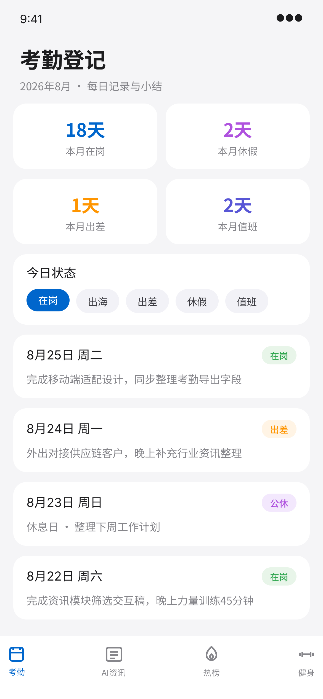
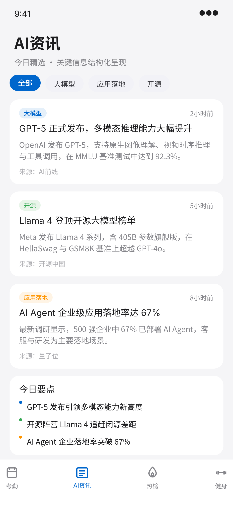
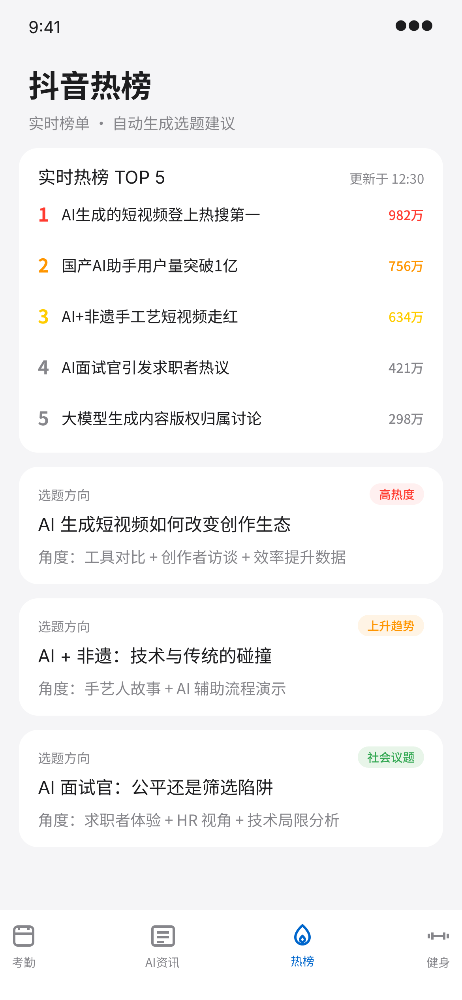
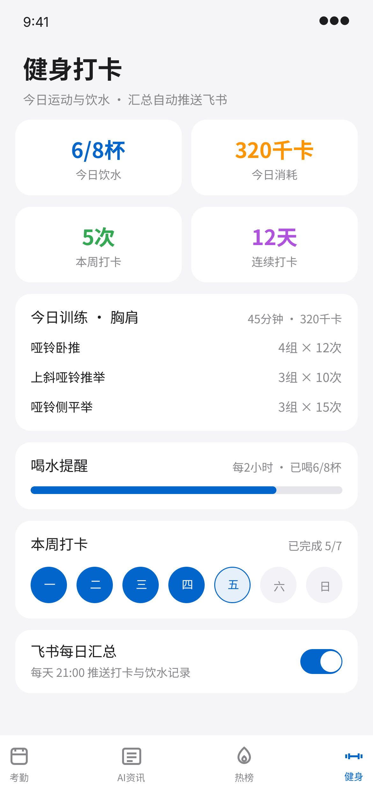

# 一人公司工作台 · One-Person Workbench

一人公司移动端工作台，四大模块：**考勤登记 · AI资讯 · 抖音热榜 · 健身打卡**。

基于 Ardot 设计稿（Apple HIG 风格设计系统，主色 `#0066CC`）构建的可交互 PWA 原型。

## ✨ 特性

- 📱 移动端优先，底部标签栏导航，页面切换带方向感过渡动画
- 📲 PWA：可「添加到主屏幕」，全屏独立运行，支持离线访问（Service Worker 缓存）
- 🎨 Apple 风格设计系统：胶囊圆角、发丝线分隔、毛玻璃标签栏、语义化状态色
- 🖥 桌面端自动适配为居中手机框预览

## 📦 结构

```
one-person-workbench/
├── index.html          # 应用入口（四屏 + 标签栏）
├── css/style.css       # 设计系统样式
├── js/app.js           # 交互逻辑（Tab 切换/胶囊选择/开关）
├── manifest.json       # PWA 清单
├── sw.js               # Service Worker 离线缓存
├── icons/              # APP 图标（192/512/180）
└── assets/screens/     # Ardot 设计稿导出图（4 屏）
```

## 🚀 使用

### 本地运行

```bash
# 任意静态服务器，例如：
npx serve .
# 或
python -m http.server 8080
```

> Service Worker 需要 `http://` 或 `https://` 环境，直接双击 index.html 功能不受影响（离线缓存除外）。

### 部署

任意静态托管均可（EdgeOne Pages / GitHub Pages / Vercel 等），上传整个目录即可。

## 🎨 设计规范速查

| Token | 值 |
|---|---|
| 主色 | `#0066CC` |
| 背景 | `#F5F5F7` |
| 文字主/次/弱 | `#1D1D1F` / `#86868B` / `#AEAEB2` |
| 卡片圆角 | `16px` |
| 在岗/出海/出差/值班/休假/请假 | `#34A853` / `#0066CC` / `#FF9500` / `#5856D6` / `#AF52DE` / `#FF3B30` |

## 📱 四屏预览

| 考勤登记 | AI资讯 | 抖音热榜 | 健身打卡 |
|---|---|---|---|
|  |  |  |  |

---

设计稿源文件：Ardot `718591693694698`
